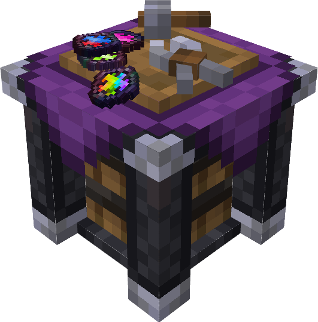

# VAULT JEWEL PURPOSER

Small mod for minecraft modpack Vault Hunters that adds a block to simplify jewel management and tool creation.

### Purpose and usefulness

When designing your tool, you do it for certain purpose. You can adjust your tool by assigning usefulness to certain attributes, with this you can:

-   make better tools than manually choosing jewels
-   make tools faster than by manually choosing jewels
-   easily decide which jewels are not worth keeping and automatically recycle them

Jewel Purposer remembers purposes that you added to it

### Tutorial

1. Craft Jewel Purposer (use JEI to see recipe)
2. Put your jewels inside (works with hoppers)
3. Create new purpose with "+" or navigate to existing one with '<' and '>' buttons
4. Insert your tool (your tool will be stored inside)
5. Configure attributes to perfect your tool

    - `TAB`, `CTRL+TAB` or mouse click to select value to edit
    - `Left Arrow`, `Right Arrow` or mouse click to select digit to edit
    - `0-9`, to set digit to specific value
    - `Up Arrow` or `Plus` to increment digit
    - `Down Arrow` or `Minus` to decrement digit

6. Click hammer button to apply jewels
7. Take back your tool

### Cutting

!! RIGHT NOW, THIS IGNORES JEWELER EXPERTISE AND DOES NOT CONSUME ANY RESOURCES. Because of that, this feature should be disabled by default, enable with gamerule vaultJpAllowCutting \
\
Jewel purposer can automatically cut jewels. \
All jewels with unspent free cuts will be cut.

### Exporting

Jewels below Dump limit will be automatically dumped into container below, this allows you to process unwanted jewels. (But make sure you don't accidentally destroy good jewels when adjusting other values)
